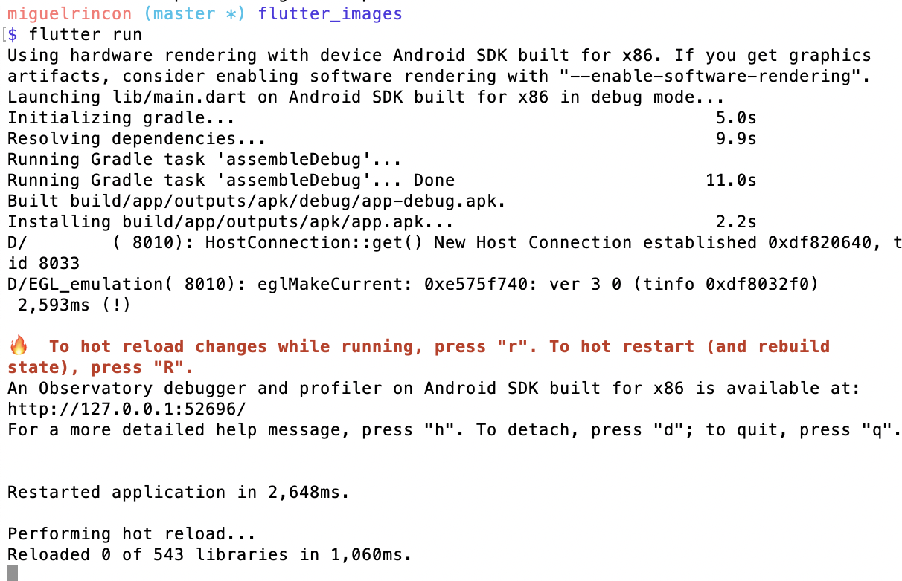
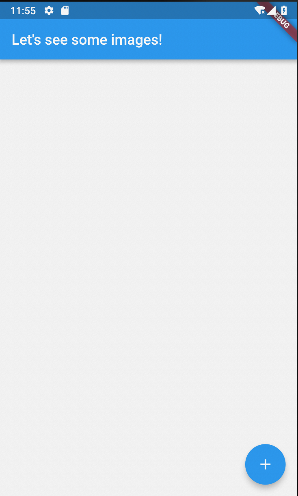

# Flutter Images App

An app which displays images from an external source.

## Description

This project displays an list of images from an external source. It uses flutter to create an app for both iOS and Android.

## Dependencies 

- `http`: Used to fetch from an external API.

### Main widgets used

- `MaterialApp`
- `Container`, `Column`, `Padding` for layout
- `AppBar`, `FloatingActionButton` for controls

## Run project

```
$ flutter run
```




See in emulator window:



## Simulator troubleshooting

Set your DNS server to `8.8.8.8` and restart the ADV and emulated devices.
